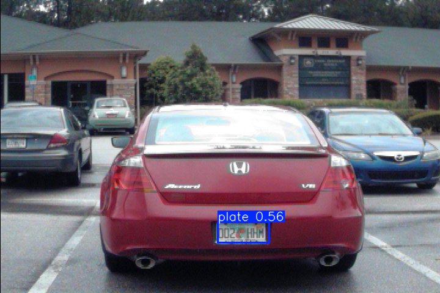
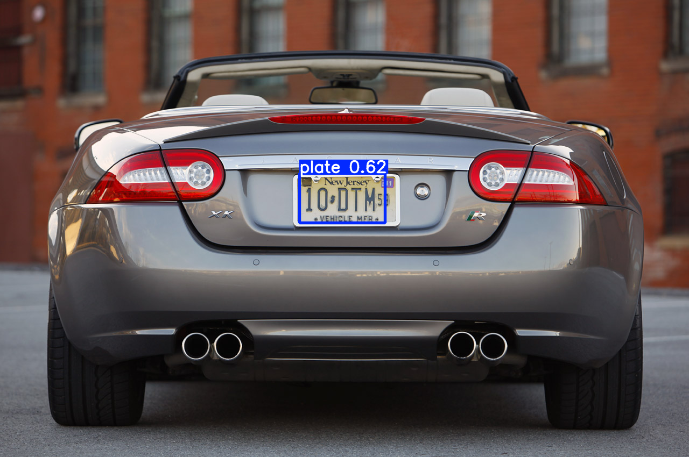

# Proyek Deteksi dan Pengenalan Plat Nomor Menggunakan YOLOv8

## Deskripsi
Proyek ini bertujuan untuk mendeteksi dan mengenali plat nomor kendaraan menggunakan model YOLOv8. Dengan memanfaatkan teknik penglihatan komputer dan analisis citra, proyek ini diharapkan dapat memberikan pemahaman yang lebih baik tentang cara kerja deteksi objek.

## Alur Proyek

1. **Persiapan Lingkungan**
   - Pastikan minimum Python 3.11.7 sudah terinstal di sistem Anda.
   - Buat virtual environment untuk proyek ini:
     ```bash
     python -m venv env
     ```
   - Aktifkan virtual environment:
     - Di Command Prompt (CMD):
       ```bash
       .\env\Scripts\activate
       ```
     - Di PowerShell:
       ```bash
       .\env\Scripts\Activate.ps1
       ```

2. **Instalasi Paket yang Diperlukan**
   - Setelah lingkungan aktif, instal paket yang diperlukan menggunakan pip:
     ```bash
     pip install ultralytics opencv-python
     ```
   - Jika pip belum terinstal, Anda perlu menginstalnya terlebih dahulu. 

3. **Persiapan Dataset**
   - Siapkan dataset gambar plat nomor dan buat struktur folder seperti berikut:
     ```
     dataset/
     ├── images/
     │   ├── train/
     │   └── val/
     ├── labels/
     │   ├── train/
     │   └── val/
     └── dataset.yaml
     ```
   - File `dataset.yaml` harus berisi informasi tentang dataset, seperti jumlah kelas dan lokasi folder gambar. Contoh isi file `dataset.yaml`:
     ```yaml
     path: dataset  # Jalur ke dataset
     train: images/train  # Jalur ke folder gambar pelatihan
     val: images/val      # Jalur ke folder gambar validasi
     nc: 1                # Jumlah kelas
     names: ['license_plate']  # Nama kelas
     ```

4. **Menulis Kode untuk Pelatihan Model**
   - Buat file Python baru, misalnya `train_model.py`, dan masukkan kode berikut:
     ```python
     from ultralytics import YOLO

     # Muat model YOLOv8
     model = YOLO('yolov8n.yaml')  # Model YOLOv8 Nano (versi lebih ringan)

     # Melatih model pada dataset plat nomor
     model.train(data='path/to/dataset.yaml', epochs=100, imgsz=640)
     ```
   - Ganti `'path/to/dataset.yaml'` dengan jalur yang sesuai ke file `dataset.yaml`.

5. **Menjalankan Pelatihan**
   - Setelah semua konfigurasi siap, jalankan pelatihan model dengan perintah:
     ```bash
     python train_model.py
     ```

6. **Pengujian dan Pengenalan Plat Nomor**
   - Setelah model selesai dilatih, Anda dapat menggunakan model untuk mendeteksi dan mengenali plat nomor pada gambar baru. Buat file baru `detect.py` dan masukkan kode berikut:
     ```python
     from ultralytics import YOLO

     # Muat model yang sudah dilatih
     model = YOLO('path/to/best.pt')  # Ganti dengan model terbaik yang dihasilkan

     # Melakukan deteksi pada gambar baru
     results = model('path/to/image.jpg')  # Ganti dengan gambar yang ingin diuji
     results.show()  # Menampilkan hasil deteksi
     ```
   - Jalankan pengujian dengan perintah:
     ```bash
     python detect.py
     ```

## Kesimpulan
Proyek ini memberikan gambaran tentang bagaimana menerapkan teknik deteksi objek menggunakan YOLOv8 untuk mendeteksi dan mengenali plat nomor. Dengan mengikuti langkah-langkah di atas, Anda dapat mengembangkan pemahaman yang lebih dalam tentang penglihatan komputer dan analisis citra.

## Catatan
- Pastikan semua dependensi terinstal dengan benar sebelum menjalankan proyek.
- Jika mengalami masalah dengan pip, pastikan Python dan pip telah terkonfigurasi dengan benar di PATH sistem Anda.

## Hasil Deteksi

Berikut adalah contoh hasil deteksi:



